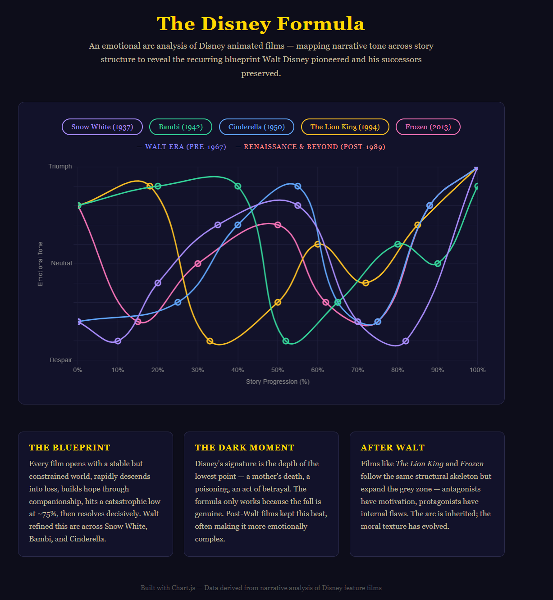

# The Disney Formula — Emotional Arc Visualizer

An interactive data visualization that maps the emotional arcs of Disney animated films across their story structure — revealing the narrative blueprint Walt Disney pioneered and his successors preserved.



---

## What This Shows

Every classic Disney film follows a near-identical emotional skeleton:

- Opens in a **constrained but stable** world
- Hits an **early loss** to establish stakes
- Builds **hope through companionship**
- Reaches a **catastrophic low** near the 75% mark
- Resolves **decisively and triumphantly**

This project plots that arc for five films — spanning from Walt's era to the modern Renaissance — and makes the pattern visible in a single chart.

---

## Films Analyzed

| Film | Year | Era |
|---|---|---|
| Snow White and the Seven Dwarfs | 1937 | Walt Disney |
| Bambi | 1942 | Walt Disney |
| Cinderella | 1950 | Walt Disney |
| The Lion King | 1994 | Disney Renaissance |
| Frozen | 2013 | Modern Disney |

---

## Features

- **Interactive line chart** — hover over any point to see the emotional tone label and story progress
- **Film toggles** — click any film's button to isolate or remove it from the chart
- **Era color coding** — Walt-era films vs. post-Walt films are visually distinguished
- **No install required** — single HTML file, Chart.js loaded via CDN

---

## How to Run

Just open the file in any browser:

```bash
# Mac / Linux
open disney_formula.html

# Windows
start disney_formula.html
```

No server. No dependencies to install. Internet connection required to load Chart.js from CDN.

---

## Key Findings

**The blueprint held.** Post-Walt films like *The Lion King* and *Frozen* follow the same structural arc Walt established in the 1930s–50s. The timing of the dark moment, the companionship interlude, and the decisive resolution are nearly identical across 80 years of filmmaking.

**The depth of the fall is the formula.** Disney's signature isn't the happy ending — it's how low the story goes before it gets there. A mother's death, a poisoning, a betrayal. The arc only works because the descent is real.

**The moral texture evolved.** Post-Walt films kept the skeleton but added complexity — antagonists with motivation, protagonists with internal flaws. The arc is inherited; the storytelling has matured.

---

## Built With

- [Chart.js](https://www.chartjs.org/) — canvas-based interactive charting
- Vanilla HTML/CSS/JavaScript — no frameworks

---

## License

MIT
